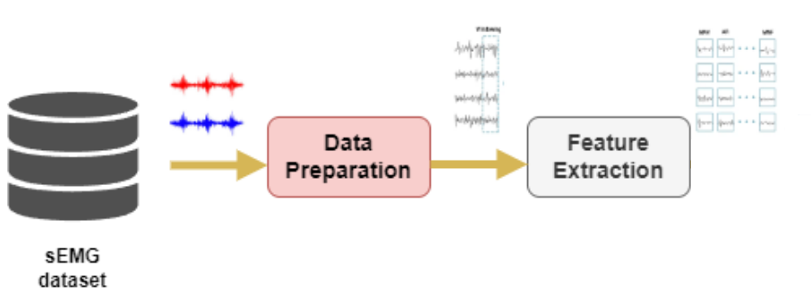

# Caracterización de tipos de agarre en sujetos sanos a partir un dataset con señales de electromiografía

## Integrantes

* Jairo Agudelo M.
* Henry Arcila.

## Descripción

El siguiente repositorio resume el proceso de ingesta de datos, preprocesamiento y extracción de caracteristicas realizado sobre la base de datos Ninapro DB1 ([link](https://ninapro.hevs.ch/instructions/DB1.html)). En la siguiente figura se muestra el procedimiento realizado sobre la base de datos hasta la extracción de caracteristicas

Como el objetivo final, consiste en generar los archivos que seran empleados para las etapas posteriores de entrenamiento y test de estos modelos, al final se realiza un analisis explorario de datos sobre los vectores caracteristicos con el fin de determinar la calidad de estos y realizar las operaciones de limpieza y filtrado en caso de ser necesarias.

El notebook que realiza el procedimiento completo se encuentra en el siguiente [link](ME03%20-%20G12%20-%20[70698438]-[98583652].ipynb). En este se realizan las siguientes tareas:
1. Ingesta de la base de datos (archivos MAT del ejercicio 1 para los 27 sujetos de prueba), los datos crudos se encuentran en el directorio [raw_datasets](./raw_datasets/).
2. Analisis y contextualización de los datos crudos recolectados.
3. Preprocesamiento de las señales de electromiografia superficial.
4. Extracción de caracteristicas de las muestras de los primeros 10 sujetos de la base de datos.
5. Analisis exploratorio de los vectores caracteristicos resultantes y generación de los directorios con los resultados los cuales se detallan a continuación:
   * **Directorio con el dataset de vectores caracteristicos**: [dataset](./datasets/) 
   * **Resultados del analisis exploratorio**: 
     * **Formato html**: [report_EDA.html](./html_report/report_EDA.html)
     * **Formato json**: [report_EDA.json](./json_report/report_EDA.json)
6. Conclusiones y trabajo futuro.
