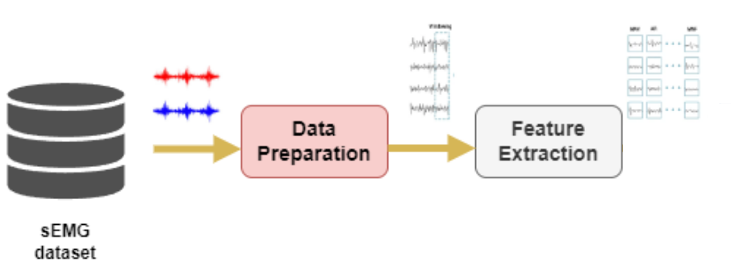

# Caracterización de tipos de agarre en sujetos sanos a partir un dataset con señales de electromiografía

El siguiente repositorio resume el proceso de ingesta de datos, preprocesamiento y extracción de caracteristicas realizado sobre la base de datos Ninapro DB1 ([link](https://ninapro.hevs.ch/instructions/DB1.html)). En la siguiente figura se muestra el procedimiento realizado sobre la base de datos hasta la extracción de caracteristicas

Como el objetivo final, consiste en generar los archivos que seran empleados para las etapas posteriores de entrenamiento y test de estos modelos, al final se realiza un analisis explorario de datos sobre los vectores caracteristicos con el fin de determinar la calidad de estos y realizar las operaciones de limpieza y filtrado en caso de ser necesarias.

El notebook que realiza el procedimiento completo se encuentra en el siguiente [link](ME03%20-%20G12%20-%20[70698438]-[98583652].ipynb).

